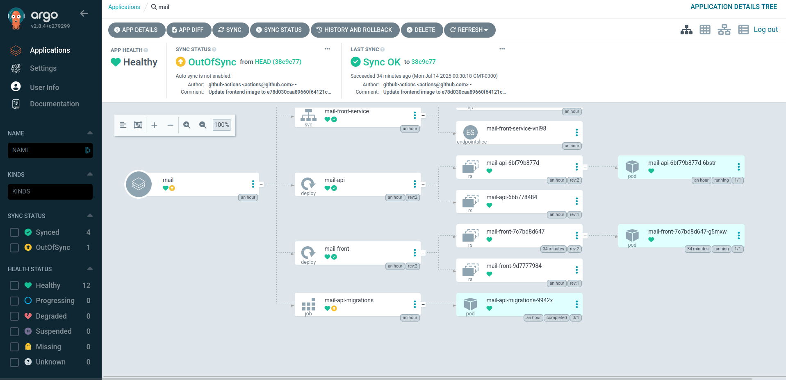

# GitOps com ArgoCD

## Instalação do ArgoCD

O ArgoCD foi instalado automaticamente durante o provisionamento utilizando **Helm integrado ao Terraform**. Isso garante que a ferramenta de GitOps esteja disponível assim que o cluster for criado, mantendo o provisionamento 100% automatizado.

A instalação utilizou:

- Helm Chart oficial do ArgoCD
- Repositório Helm: `https://argoproj.github.io/argo-helm`
- Versão: `5.46.7`
- Namespace: `argocd` (criado automaticamente)
- Arquivo de valores personalizado: `argocd-values.yaml`

Perfeito! Aqui está a **seção 5 – GitOps com ArgoCD** refeita corretamente, com a marcação Markdown organizada, legível e técnica — pronta para ser salva como `5-gitops-com-argocd.md`.

---

## Repositório Git Utilizado

O repositório Git utilizado para o fluxo GitOps foi o **GitHub**, centralizando toda a lógica de infraestrutura e de aplicações em uma única fonte de verdade.

---

## Estrutura do Repositório GitOps

A estrutura do repositório segue o padrão declarativo e modular, separando recursos de infraestrutura (Terraform) dos recursos de aplicação (Kubernetes).

```bash
📦 repositório/
├── terraform/         # Infraestrutura (EKS, RDS, VPC, IAM, etc.)
└── k8s/               # Manifests Kubernetes para deploy
    ├── backend/
    │   ├── deployment.yaml
    │   ├── service.yaml
    │   └── kustomization.yaml
    ├── frontend/
    │   ├── deployment.yaml
    │   ├── service.yaml
    │   └── kustomization.yaml
    └── kustomization.yaml   # Aponta para backend/ e frontend/
```

Essa estrutura permite que o ArgoCD acompanhe o diretório `k8s/` via Kustomize, simplificando o deploy e a manutenção das aplicações.

---

## Deploy da Aplicação via ArgoCD

O deploy da aplicação foi feito manualmente via ArgoCD, utilizando a interface gráfica da ferramenta. O ArgoCD foi configurado para apontar para o diretório k8s/ do repositório Git, e sincroniza os recursos de acordo com os manifests definidos no repositório.
---

## Screenshots do ArgoCD Funcionando

Abaixo, uma imagem do ArgoCD mostrando o status dos deployments e serviços da aplicação:


---

Com esse fluxo, qualquer alteração no repositório Git dispara a atualização automática no cluster Kubernetes, mantendo os ambientes sempre alinhados com o código-fonte — princípio central do GitOps.

